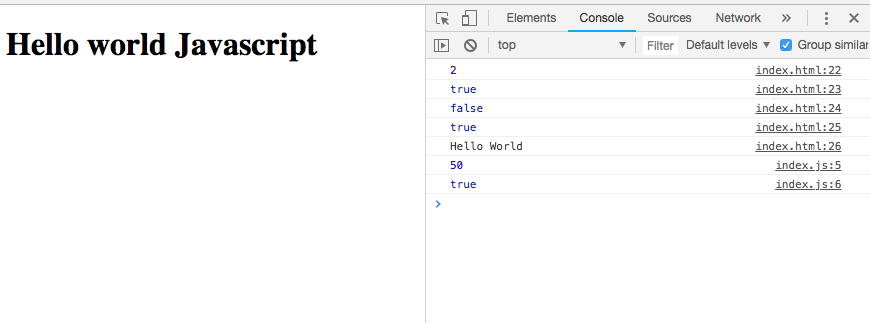
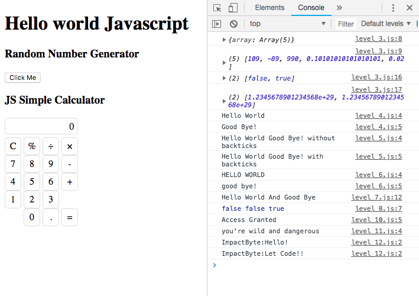

# Learn how to use Javascript with html

## Learning Javascript 1 -3

below image is the result

if you write
- 123
- 234
- 345
- 456

alert will tell you everything okay but when you put different number from list above, you need to open file level_8.js

Below is the list for javascript level I Am write

- [level 00](https://github.com/indraakkk/indra-js/blob/master/js/level_0.js)

- [level 01](https://github.com/indraakkk/indra-js/blob/master/js/level_1.js)

- [level 02](https://github.com/indraakkk/indra-js/blob/master/js/level_2.js)

- [level 03](https://github.com/indraakkk/indra-js/blob/master/js/level_3.js)

- [level 04](https://github.com/indraakkk/indra-js/blob/master/js/level_4.js)

- [level 05](https://github.com/indraakkk/indra-js/blob/master/js/level_5.js)

- [level 06](https://github.com/indraakkk/indra-js/blob/master/js/level_6.js)

- [level 07](https://github.com/indraakkk/indra-js/blob/master/js/level_7.js)

- [level 08](https://github.com/indraakkk/indra-js/blob/master/js/level_8.js)

- [level 09](https://github.com/indraakkk/indra-js/blob/master/js/level_9.js)

- [level 10](https://github.com/indraakkk/indra-js/blob/master/js/level_10.js)

- [level 11](https://github.com/indraakkk/indra-js/blob/master/js/level_11.js)

- [level 12](https://github.com/indraakkk/indra-js/blob/master/js/level_12.js)

- [level 13](https://github.com/indraakkk/indra-js/blob/master/js/level_13.js)

## New Web-based Calculator Function

