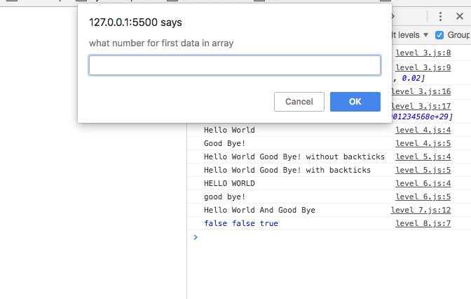

# Learn how to use Javascript with html

below image is the result

if you write
- 123
- 234
- 345
- 456

alert will tell you everything okay but when you put different number from list above, you need to open file level_8.js